**NOTE**: You can find all the YAML manifest files used for this challenge in the current directory in this repo

## Step 1: Identify the image with zero CRITICAL Vulnerability

List all the images present 

```bash
root@controlplane$ docker images
```

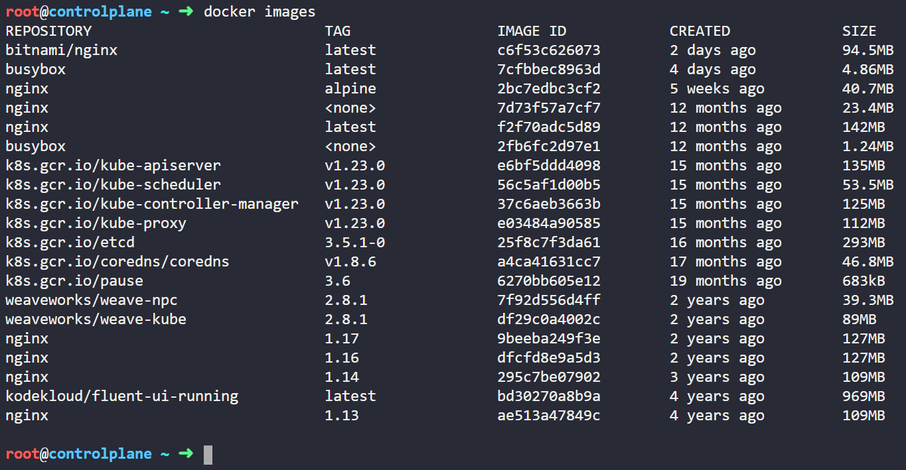

You will see that all those 6 images are already present in the lab environment.

Next I will show you how to scan those six images with Aquasec Trivy.

*I did not have any knowledge on Aquasec Trivy prior to this lab, but I was still able to complete the task. I was able to do so with just some curiosity and common commands, let me show you how.*

When you click on the *Images* icon (in CKS challenge lab), there you will get a hint *Use 'trivy' to find the image with the least number of 'CRITICAL' vulnerability*

Simply run 'trivy' command and observe the output

```bash
root@controlplane$ trivy
```

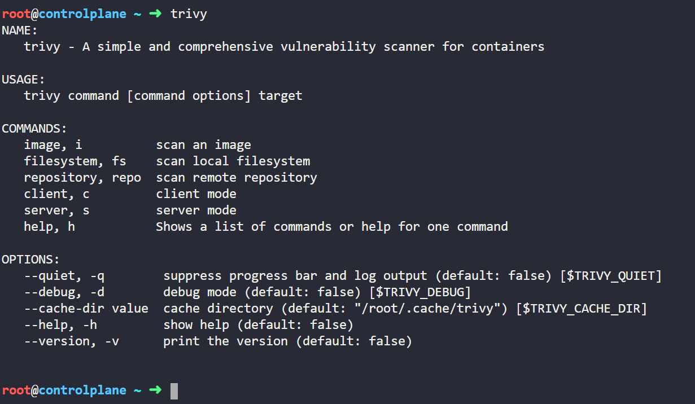

Read the ouput, you will get to know that trivy is used to scan images for vulnerabilities and you can run *trivy image* command to scan a an image.

```bash
root@controlplane$ trivy image
```

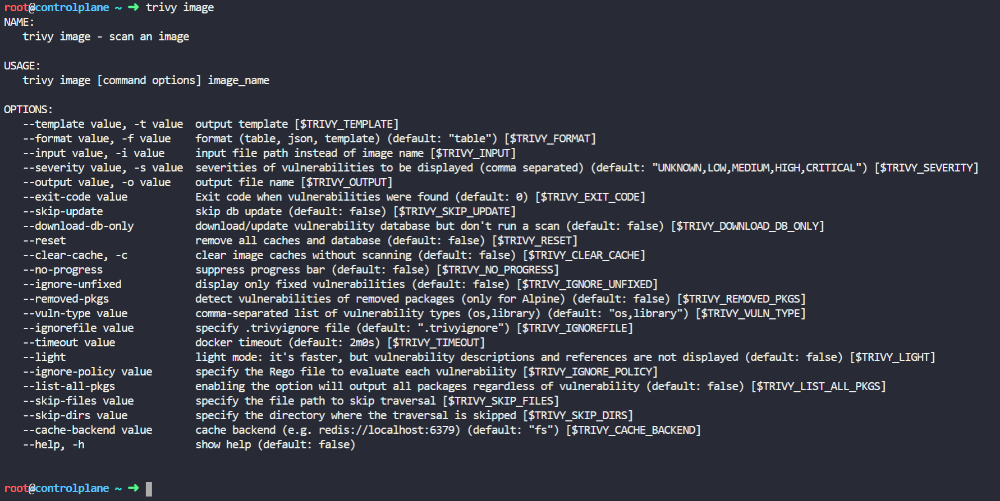

You can see under the Usage section, there is a sample command on how to scan an image.

Run the following command to scan the image nginx:alpine

```bash
root@controlplane$ trivy image nginx:alpine
```

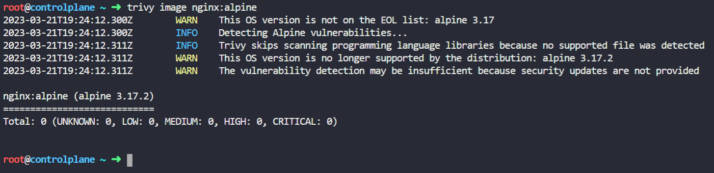

You can see that there are no CRITICAL vulnerabilities in nginx:alpine

Similarly scan all the images to find out CRITICAL vulnerability count for all the images.

Run the following commands:

```bash
root@controlplane$ trivy image nginx:alpine
root@controlplane$ trivy image bitnami/nginx
root@controlplane$ trivy image nginx:1.13
root@controlplane$ trivy image nginx:1.17
root@controlplane$ trivy image nginx:1.16
root@controlplane$ trivy image nginx:1.14
```

**NOTE**: You will get detailed view of the scan report for other images as they contain vulnerabilities. The summay of vulnerability count is present at the beginning of the output.

You will find out that the image *nginx:alpine* has the least number of CRITICAL vulnerabilites. So we will be using this image in our deployment.

## Step 2: Enforce the AppArmor profile 

Click on *custom-nginx* icon (in CKS challenge lab), you need to complete two small tasks to enforce the AppArmor profile.

Run the following command to move the AppArmor profile from '/root/usr.sbin.nginx' to '/etc/apparmor.d/usr.sbin.nginx'

```bash
root@controlplane$ mv /root/usr.sbin.nginx /etc/apparmor.d/usr.sbin.nginx
```

Run the following command to load the AppArmor profile.

**NOTE**: It's very helpful, if you know how to navigate through K8s documentation. I found the below mentioned command from this [article](https://kubernetes.io/docs/tutorials/security/apparmor/ "Restrict a Container's Access to Resources with AppArmor") from K8s documentation.

```bash
root@controlplane$ sudo apparmor_parser -q /etc/apparmor.d/usr.sbin.nginx
```

Run the below command to verify whether the AppArmor profile was loaded successfully or not. I found the below command from the same K8s documentation article.

```bash
root@controlplane$ sudo cat /sys/kernel/security/apparmor/profiles | grep -i custom-nginx
```

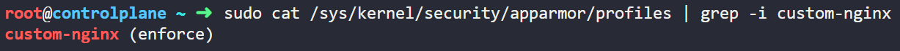

In the above image, notice that the AppArmor profile is loaded successfully and is enforced and is ready to be used in deployment.

## Step 3: Bound the PersistentVolumeClaim to PersistentVolume

Click on *alpha-pvc* icon (in CKS challenge lab) on the interactive image to see the details of the PVC

Run the following command and note the ACCESS MODES and STORAGECLASS value for the PersistentVolume which will be used later

```bash
root@controlplane$ kubectl get pv
```

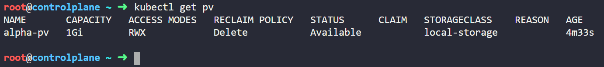

In the above image, notice that the STATUS of *alpha-pv* is available.

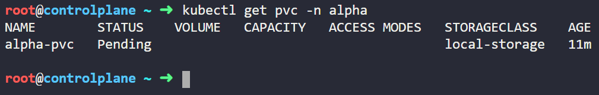

Run the following command to know the status of PVC

```bash
root@controlplane$ kubectl get pvc -n alpha
```


STORAGECLASS value is same for PVC and PV but ACCESS MODES value is missing in PVC andyYou can see that the status of PVC is pending. Let's delete it and create a new PVC

```bash
root@controlplane$ kubectl delete pvc -n alpha alpha-pvc
```

Now create a PersistentVolumeClaim manifest file and add same access mode as of PV. 

```bash
root@controlplane$ vim pvc.yaml
```

```yaml
apiVersion: v1
kind: PersistentVolumeClaim
metadata:
  name: alpha-pvc
  namespace: alpha
spec:
  accessModes:
  - ReadWriteMany
  resources:
    requests:
      storage: 1Gi
  storageClassName: local-storage
  volumeMode: Filesystem
```

*NOTE: type :wq! inside the VIM editor to save and exit the file.*

Run the below command to create a PersistentVolumeClaim

```bash
root@controlplane$ kubectl apply -f pvc.yaml
```

Run the below command to check the STATUS of PVC

```bash
root@controlplane$ kubectl get pvc -n alpha
```

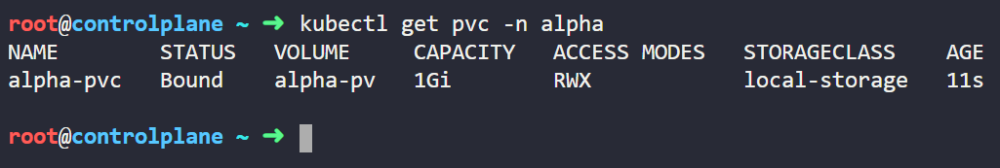

Notice that the *alpha-pvc* is now bound to *alpha-pv*

Run the below command to check the STATUS of PV

```bash
root@controlplane$ kubectl get pv
```

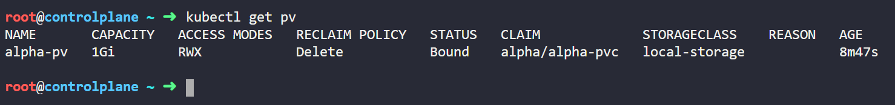

Notice that now the STATUS of *alpha-pv* is now BOUND. Now the *alpha-pvc* is successfully bound to *alpha-pv*

## Step 4: Create the deployment

Click on *alpha-xyz* icon (in CKS challenge lab) to see the details of the deployment.

We will be using image *nginx:alpine*, since it has least CRITICAL vulnerabilities amongst all the 6 images.

Edit the '/root/alpha-xyz.yaml' file and add code snippets to add:
* Container image name (spec.template.spec.containers.image)
* Annotations, that tells K8s to apply AppArmor profile (spec.template.metadata.annotations)
* Add volume info (spec.template.spec.volumes) and mount it (spec.template.spec.containers.volumeMounts)
* Also add container port (spec.template.spec.containers.ports.containerPort)


```bash
root@controlplane$ vim alpha-xyz.yaml
```

```yaml
apiVersion: apps/v1
kind: Deployment
metadata:
  creationTimestamp: null
  labels:
    app: alpha-xyz
  name: alpha-xyz
  namespace: alpha
spec:
  replicas: 1
  selector:
    matchLabels:
      app: alpha-xyz
  strategy: {}
  template:
    metadata:
      creationTimestamp: null
      labels:
        app: alpha-xyz
      annotations: 
        container.apparmor.security.beta.kubernetes.io/nginx: localhost/custom-nginx
    spec:
      containers:
      - image: nginx:alpine
        name: nginx
        ports:
        - containerPort: 80
        volumeMounts:
          - name: data-volume
            mountPath: "/usr/share/nginx/html"
      volumes:
        - name: data-volume
          persistentVolumeClaim: 
            claimName: alpha-pvc
```

*NOTE: type :wq! inside the VIM editor to save and exit the file.*

```bash
root@controlplane$ kubectl apply -f alpha-xyz.yaml
```

Verify the deployemnt by running the following commands

```bash
root@controlplane$ kubectl get deployment -n alpha
```

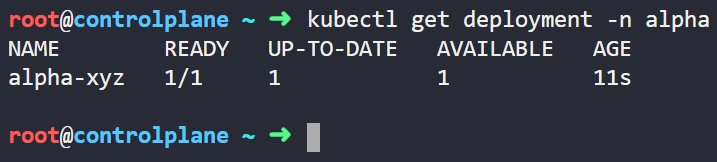

```bash
root@controlplane$ kubectl get pod -n alpha
```

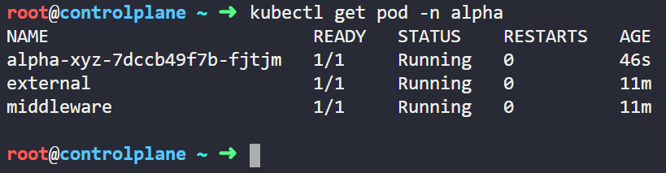

Both the deployment *alpha-xyz* and pod created by the deployment are running successfully. Now we can proceed to the next step.

## Step 5: Expose the deployment via Service

Click on *alpha-svc* icon (in CKS challenge lab) to see the details of the service.

Create a manifest file for Service. 

```bash
root@controlplane$ vim service.yaml
```

```yaml
apiVersion: v1
kind: Service
metadata:
  name: alpha-svc
  namespace: alpha
spec:
  type: ClusterIP
  selector:
    app: alpha-xyz
  ports:
    - port: 80
      targetPort: 80
```

*NOTE: type :wq! inside the VIM editor to save and exit the file.*

```bash
root@controlplane$ kubectl apply -f service.yaml
```

Verify the service *alpha-svc* by running the following commands

```bash
root@controlplane$ kubectl describe service -n alpha alpha-svc
```

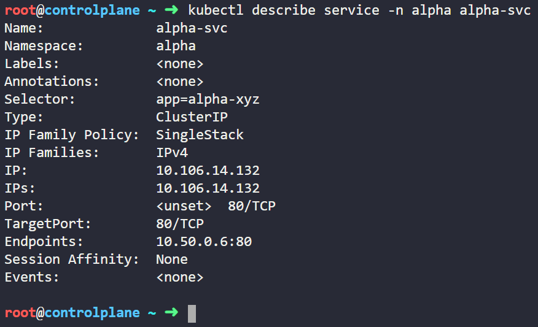

Notice the IP address corresponding to Endpoints, this should match with the pod created by *alpha-xyz* deployment. Run the following command to get the IP address of pod

```bash
root@controlplane$ kubectl get pod -n alpha -o wide
```

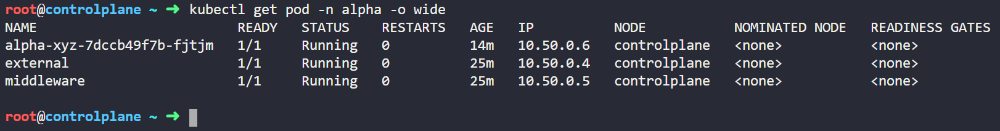

Notice that the IP address of *alpha-xyz* pod is same as the Endpoint value in *alpha-svc*. Hence, the deployment is successfully exposed. Now we can proceed to the next step.

## Step 6: Restrict network traffic with Network Policy

Refer this [K8s documentation article](https://kubernetes.io/docs/concepts/services-networking/network-policies/ "Network Policies") for reference to Network Policies.

Click on *restric-inbound* icon (in CKS challenge lab) on the interactive image to see the details of the NetworkPolicy

Create a manifest file for *restric-inbound* NetworkPolicy

```bash
root@controlplane$ vim netpol.yaml
```

```yaml
apiVersion: networking.k8s.io/v1
kind: NetworkPolicy
metadata:
  name: restrict-inbound
  namespace: alpha
spec:
  podSelector:
    matchLabels:
      app: alpha-xyz
  policyTypes:
    - Ingress
  ingress:
    - from:
        - podSelector:
            matchLabels:
              app: middleware
      ports:
        - protocol: TCP
          port: 80
```

*NOTE: type :wq! inside the VIM editor to save and exit the file.*

```bash
root@controlplane$ kubectl apply -f netpol.yaml
```

Verify the NetworkPolicy *restrict-inbound* by running the following commands

```bash
root@controlplane$ kubectl describe netpol -n alpha restrict-inboun
```

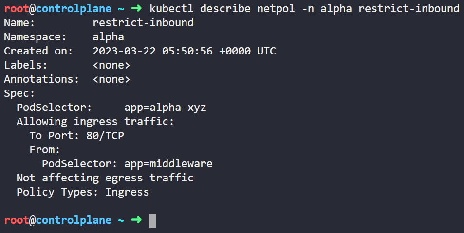

Notice that the *restrict-inbound* NetworkPolicy satisfies all the conditions.

Now click on CHECK button in the lab to submit your solution. If you were able to compelete all the above mentioned steps, then your submission should pass in the first go. If not, happy troubleshooting (which is my fav part)!