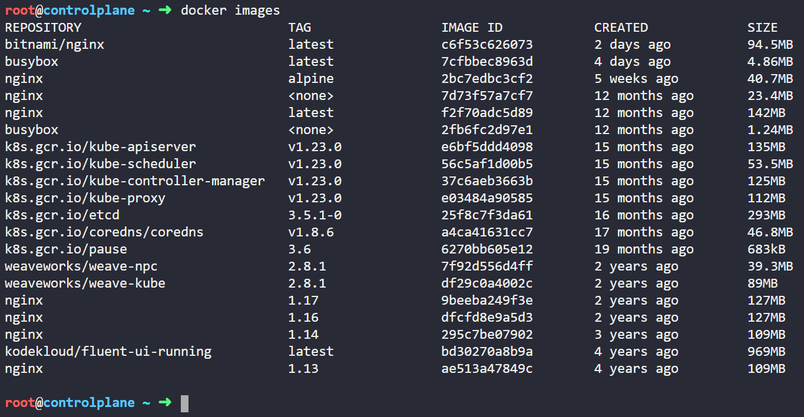
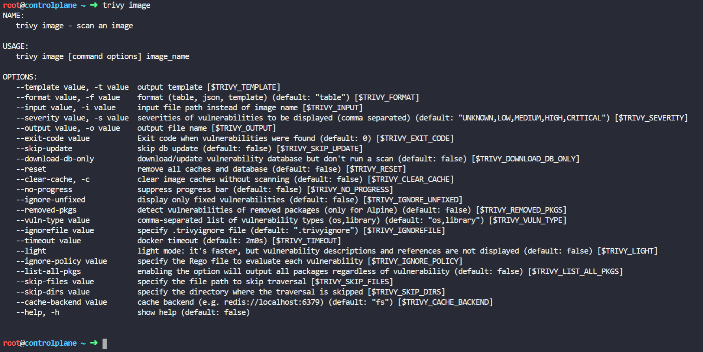

## Step 1: Identify the image with zero CRITICAL vulnerability

List all the images present 

```bash
docker images
```



You will see that all those 6 images are already present in the lab environment.

Next I will show you how to scan those six images with Aquasec Trivy.

*I did not have any knowledge on Aquasec Trivy prior to this lab, but I was still able to complete the task. I was able to do so with just some curiosity and common commands, let me show you how.*

When you click on the *Images* icon, there you will get a hint *Use 'trivy' to find the image with the least number of 'CRITICAL' vulnerability*

Simply run 'trivy' command and observe the output

```bash
root@controlplane$ trivy
```


Read the ouput, you will get to know that trivy is used to scan images for vulnerabilities and you can run *trivy image* command to scan a an image.

```bash
root@controlplane$ trivy image
```



## Step 2: Enforce the AppArmor profile 

## Step 3: Expose the deployment 

## Step 4: Restrict network traffic with Network Policy