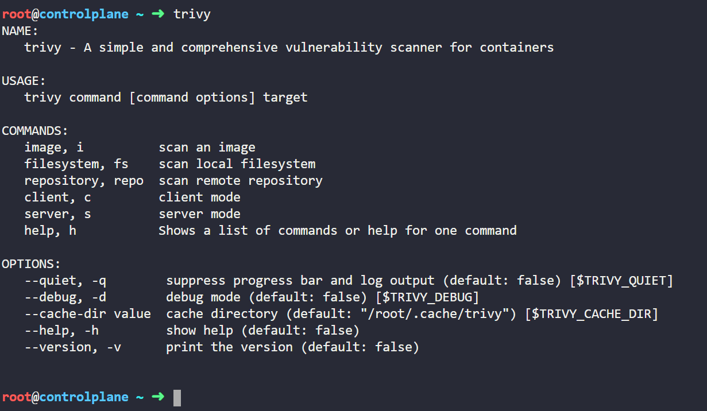

**NOTE**: Follow this guide along with the [KodeKloud's CKS Challenge Lab](https://kodekloud.com/courses/cks-challenges/ "KodeKloud CKS Challenges") for best experience.

## Step 1: Identify the image with zero CRITICAL Vulnerability

List all the images present 

```bash
root@controlplane$ docker images
```


You will see that all those 6 images are already present in the lab environment.

Next I will show you how to scan those six images with Aquasec Trivy.

*I did not have any knowledge on Aquasec Trivy prior to this lab, but I was still able to complete the task. I was able to do so with just some curiosity and common commands, let me show you how.*

When you click on the *Images* icon, there you will get a hint *Use 'trivy' to find the image with the least number of 'CRITICAL' vulnerability*

Simply run 'trivy' command and observe the output

```bash
root@controlplane$ trivy
```



Read the ouput, you will get to know that trivy is used to scan images for vulnerabilities and you can run *trivy image* command to scan a an image.

```bash
root@controlplane$ trivy image
```


You can see under the Usage section, there is a sample command on how to scan an image.

Run the following command to scan the image nginx:alpine

```bash
root@controlplane$ trivy image nginx:alpine
```


You can see that there are no CRITICAL vulnerabilities in nginx:alpine

Similarly scan all the images to find out CRITICAL vulnerability count for all the images.

Run the following commands:

```bash
root@controlplane$ trivy image nginx:alpine
root@controlplane$ trivy image bitnami/nginx
root@controlplane$ trivy image nginx:1.13
root@controlplane$ trivy image nginx:1.17
root@controlplane$ trivy image nginx:1.16
root@controlplane$ trivy image nginx:1.14
```

**NOTE**: You will get detailed view of the scan report for other images as they contain vulnerabilities. The summay of vulnerability count is present at the beginning of the output.

You will find out that the image *nginx:alpine* has the least number of CRITICAL vulnerabilites. So we will be using this image in our deployment.

## Step 2: Enforce the AppArmor profile 

Click on *custom-nginx* icon (present on GUI), you need to complete two small tasks to enforce the AppArmor profile.

Run the following command to move the AppArmor profile from '/root/usr.sbin.nginx' to '/etc/apparmor.d/usr.sbin.nginx'

```bash
root@controlplane$ mv /root/usr.sbin.nginx /etc/apparmor.d/usr.sbin.nginx
```

Run the following command to load the AppArmor profile.

**NOTE**: It's very helpful, if you know how to navigate through K8s documentation. I found the below mentioned command from this [article](https://kubernetes.io/docs/tutorials/security/apparmor/ "Restrict a Container's Access to Resources with AppArmor") from K8s documentation.

```bash
root@controlplane$ sudo apparmor_parser -q /etc/apparmor.d/usr.sbin.nginx
```

Run the below command to verify whether the AppArmor profile was loaded successfully or not. I found the below command from the same K8s documentation article.

```bash
root@controlplane$ sudo cat /sys/kernel/security/apparmor/profiles | grep -i custom-nginx

>> custom-nginx (enforce)
```

Now the AppArmor profile is loaded and is ready to be used in deployment

## Step 3: Bound the PersistentVolumeClaim to PersistentVolume

Click on *alpha-pvc* icon on the interactive image to see the details of the PVC

Run the following command to know the status of PVC

```bash
root@controlplane$ kubectl get pvc -n alpha
```


You can see that the status of PVC is pending. Let's delete it and create a new PVC

```bash
root@controlplane$ kubectl delete pvc -n alpha alpha-pvc
```

Run the following command and note the ACCESS MODES and STORAGECLASS value for the PersistentVolume which will be used to create PersistentVolumeClaim

```bash
root@controlplane$ kubectl get pv
```

Now create a PersistentVolumeClaim manifest file. Refer to *pvc.yaml* file present under folder *CHALLENGE 1* in this repository

```bash
root@controlplane$ vim pvc.yaml
```

```yaml
apiVersion: v1
kind: PersistentVolumeClaim
metadata:
  name: alpha-pvc
  namespace: alpha
spec:
  accessModes:
  - ReadWriteMany
  resources:
    requests:
      storage: 1Gi
  storageClassName: local-storage
  volumeMode: Filesystem
```

Run the below command to create a PersistentVolumeClaim

```bash
root@controlplane$ kubectl apply -f pvc.yaml
```

Run the below command to check the STATUS of PVC

```bash
root@controlplane$ kubectl get pvc -n alpha
```


Notice that the alpha-pvc is now bound to alpha-pv

## Step 4: Create the deployment

Click on *alpha-xyz* icon on the interactive image (in lab's GUI) to see the details of the deployment.

Edit the '/root/alpha-xyz.yaml' file 

## Step 5: Expose the deployment 

## Step 6: Restrict network traffic with Network Policy