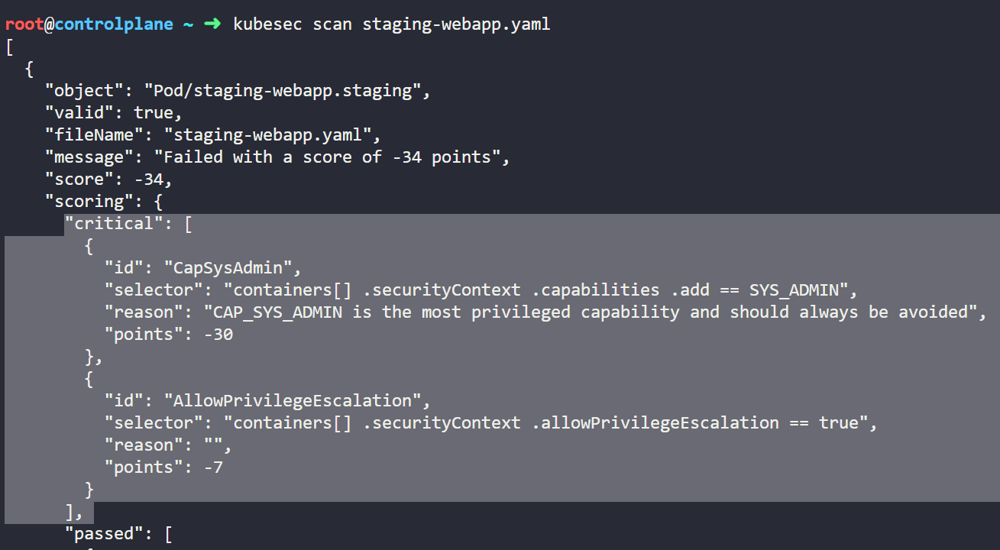
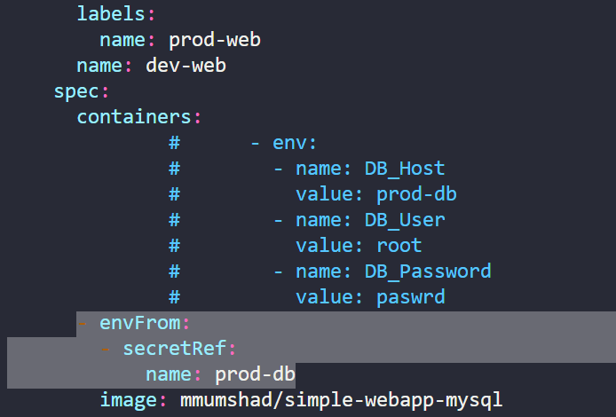

**NOTE**: You can find all the YAML manifest files used for this challenge in the current directory.

<details>

<summary><h2>Step 1: Dockerfile (webapp)</h2></summary>

*Click on Dockerfile(webapp) icon present in the interactive architecture diagram in the challenge lab*

### Task 1: Run as non root (instead, use correct application user)

Run the below command to see the Dockerfile.

```bash
root@controlplan$ cat webapp/Dockerfile
```


You can see in the above image that the container is run as a root user, whereas the flask app is run as user worker. As per the challenge, the container should run as a non root user (application user)

Refer to this [article](https://www.geeksforgeeks.org/docker-user-instruction/ "Docker USER instruction") for an overview of USER command.

In the Dockerfile, replace 'USER root' with 'USER worker'

### Task 2: Avoid exposing unnecessary ports

In the Dockerfile, you can see that two ports are exposed with 'EXPOSE' command.

Refer to this [article](https://www.geeksforgeeks.org/docker-expose-instruction/ "Docker EXPOSE instruction") for an overview of EXPOSE command.

Port 8080 is used by the flask app. Port 22 is used for SSH connections, which is not required in this case. So you can remove 'EXPOSE 22' from the Dockerfile.

### Task 3: Avoid copying the 'Dockerfile' and other unnecessary files and directories in to the image. Move the required files and directories (app.py, requirements.txt and the templates directory) to a subdirectory called 'app' under 'webapp' and update the COPY instruction in the 'Dockerfile' accordingly.

See the COPY command of Dockerfile, it copies all the files and directories present in webapp directory in to the image. 

Execute the following commands to move webapp/app.py, webapp/requirements.txt, webapp/templates to app under webapp.

Refer to this [article](https://www.geeksforgeeks.org/docker-copy-instruction/ "Docker COPY instruction") for an overview of COPY command.

```bash
root@controlplan$ cd webapp
root@controlplan$ mkdir app
root@controlplan$ mv app.py app
root@controlplan$ mv requirements.txt app
root@controlplan$ mv templates app
```

Now update the COPY command to copy all files from app directory to /opt

COPY /app /opt/

The final Dockerfile will have the following commands.

```Dockerfile
FROM python:3.6-alpine
RUN pip install flask
COPY /app /opt/
EXPOSE 8080
RUN adduser -D worker
WORKDIR /opt
USER worker
ENTRYPOINT ["python", "app.py"]
```

Update the Dockerfile and save it.

You can click on the 'Check' button to verify that this task is now completed.

### Task 4: Once the security issues are fixed, rebuild this image locally with the tag 'kodekloud/webapp-color:stable'

Refer to this [article](https://devopscube.com/build-docker-image/ "Docker BUILD image") for an overview of Docker BUILD command.

Run the following command to build the image locally.

```bash
root@controlplan$ docker build -t kodekloud/webapp-color:stable .
```

You can click on the 'Check' button to verify that this task is now completed.

</details>

<details>

<summary><h2>Step 2: kubesec</h2></summary>

*Click on kubesec icon present in the interactive architecture diagram in the challenge lab*

*Find all the YAML files used in this step under kubesec folder inside this directory*

### Task 1: Fix issues with the '/root/dev-webapp.yaml' file which was used to deploy the 'dev-webapp' pod in the 'dev' namespace.

As mentioned in the challenge, first, we need to identify issues with YAML manifests file with kubesec.

Run the following command to explore kubesec.

```bash
root@controlplan$ kubesec
```


In the above image, you can see that using 'scan' command, kubesec scans kubernetes resource YAML. So, let's run the below command to examine kubesec scan in detail.

```bash
root@controlplan$ kubesec scan
```


See the examples mentioned in the above image. Let's run the following command to scan the YAML file.

```bash
root@controlplan$ kubesec scan dev-webapp.yaml
```


In the above image, we can see that there are two critical issues with dev-webapp.yaml. Let's modify the dev-webapp.yaml file accordingly.


See the above image, change the allowPrivilegeEscalation to false and remove SYS_ADMIN from capabilities.

You can click on the 'Check' button to verify that this task is now completed.

### Task 2: Redeploy the 'dev-webapp' pod once issues are fixed with the image 'kodekloud/webapp-color:stable'

Edit the dev-webapp.yaml file and update the image.

```bash
root@controlplan$ vim dev-webapp.yaml
```


Save the file and exit.

Run the following command to delete the dev-webapp pod and create a new dev-webapp pod.

```bash
root@controlplan$ kubectl delete pod -n dev dev-webapp --force --grace-period=0
root@controlplan$ kubectl apply -f dev-webapp.yaml
```

You can click on the 'Check' button to verify that this task is now completed.

### Task 3: Fix issues with the '/root/staging-webapp.yaml' file which was used to deploy the 'staging-webapp' pod in the 'staging' namespace.

As mentioned in the challenge, first, we need to identify issues with YAML manifests file with kubesec. Let's run the following command to scan the YAML file.

```bash
root@controlplan$ kubesec scan staging-webapp.yaml
```



In the above image, we can see that there are two critical issues with staging-webapp.yaml. Let's modify the staging-webapp.yaml file accordingly.


See the above image, change the allowPrivilegeEscalation to false and remove SYS_ADMIN from capabilities.

You can click on the 'Check' button to verify that this task is now completed.

### Task 4: Redeploy the 'staging-webapp' pod once issues are fixed with the image 'kodekloud/webapp-color:stable'

Edit the staging-webapp.yaml file and update the image.

```bash
root@controlplan$ vim staging-webapp.yaml
```


Save the file and exit.

Run the following command to delete the dev-webapp pod and create a new dev-webapp pod.

```bash
root@controlplan$ kubectl delete pod -n staging staging-webapp --force --grace-period=0
root@controlplan$ kubectl apply -f staging-webapp.yaml
```

You can click on the 'Check' button to verify that this task is now completed.

</details>

<details>

<summary><h2>Step 3: dev-webapp</h2></summary>

*Click on dev-webapp icon present in the interactive architecture diagram in the challenge lab*

*Find all the YAML files used in this step under dev-webapp folder inside this directory*

### Task 1: This pod can be accessed using the 'kubectl exec' command. We want to make sure that this does not happen. Use a startupProbe to remove all shells before the container startup. Use 'initialDelaySeconds' and 'periodSeconds' of '5'

We need to remove all shells of this container using startupProbe. Let's first identify all the shells of this container. Run the below mentioned commands.

```bash
root@controlplan$ kubectl exec -it -n dev dev-webapp -- /bin/sh
root@controlplan$ cat /etc/shells
```


See the above image, we need to remove /bin/sh and /bin/ash shells from this container.

Edit the dev-webapp.yaml file and add code snippet to include startupProbe.

Refer to this [article](https://kubernetes.io/docs/tasks/configure-pod-container/configure-liveness-readiness-startup-probes/ "Startup Probes") for an overview of startupProbes.

```bash
root@controlplan$ vim dev-webapp.yaml
```


Save the file and exit.

Run the following command to delete the dev-webapp pod and create a new dev-webapp pod.

```bash
root@controlplan$ kubectl delete pod -n dev dev-webapp --force --grace-period=0
root@controlplan$ kubectl apply -f dev-webapp.yaml
```

You can click on the 'Check' button to verify that this task is now completed.

</details>

<details>

<summary><h2>Step 4: staging-webapp</h2></summary>

*Click on staging-webapp icon present in the interactive architecture diagram in the challenge lab*

*Find all the YAML files used in this step under staging-webapp folder inside this directory*

### Task 1: This pod can be accessed using the 'kubectl exec' command. We want to make sure that this does not happen. Use a startupProbe to remove all shells before the container startup. Use 'initialDelaySeconds' and 'periodSeconds' of '5'

Similar to dev-webapp, we need to remove all shells of this container using startupProbe. Let's first identify all the shells of this container. Run the below mentioned commands.

```bash
root@controlplan$ kubectl exec -it -n staging staging-webapp -- /bin/sh
root@controlplan$ cat /etc/shells
```


See the above image, we need to remove /bin/sh and /bin/ash shells from this container.

Edit the staging-webapp.yaml file and add code snippet to include startupProbe. StartupProbe removes the shells as soon as container is started so that no one can exec into the pod.

```bash
root@controlplan$ vim staging-webapp.yaml
```


Save the file and exit.

Run the following command to delete the dev-webapp pod and create a new dev-webapp pod.

```bash
root@controlplan$ kubectl delete pod -n staging staging-webapp --force --grace-period=0
root@controlplan$ kubectl apply -f staging-webapp.yaml
```

You can click on the 'Check' button to verify that this task is now completed.

</details>

<details>

<summary><h2>Step 5: prod-web</h2></summary>

*Click on prod-web icon present in the interactive architecture diagram in the challenge lab*

*Find all the YAML files used in this step under prodNamespace folder inside this directory*

### Task 1: The deployment has a secret hardcoded. Instead, create a secret called 'prod-db' for all the hardcoded values and consume the secret values as environment variables within the deployment.

Run the following command to store the deployment manifest file.

```bash
root@controlplan$ kubectl get deployments -n prod prod-web -o yaml > deployment.yaml
```

Below image shows the hardcoded secrets present in deployment.yaml


Create a secret.yaml file and store these variables in base64 encoded format.

Run the following command to get the base64 encoded values.

```bash
root@controlplan$ echo -n 'prod-db' | base64
root@controlplan$ echo -n 'root' | base64
root@controlplan$ echo -n  'paswrd' | base64
```

```bash
root@controlplan$ vim secret.yaml 
```

```YAML
apiVersion: v1
kind: Secret
metadata:
  name: prod-db
  namespace: prod
data:
  DB_Host: cHJvZC1kYg==
  DB_User: cm9vdA==
  DB_Password: cGFzd3Jk
```

Open the deployment.yaml and remove prepopulated fields like annotations, etc. Remove the hardcoded values and add a refernce to secret as environment variable, as shown in the image below.



Refer to this [article](https://kubernetes.io/docs/tasks/inject-data-application/distribute-credentials-secure/#configure-all-key-value-pairs-in-a-secret-as-container-environment-variables "Secret as env variable") for a guide on how to configure all key value pairs in a secret as container environment variables.

(The resulting deployment file is also present in this directory by the name of deployment.yaml, you can use it directly)

Now delete the existing deployment, create secret and new deployment using that secret, by running the following command.

```bash
root@controlplan$ kubectl delete deployment -n prod prod-web 
root@controlplan$ kubectl apply -f secret.yaml
root@controlplan$ kubectl apply -f deployment.yaml 
```

You can click on the 'Check' button to verify that this task is now completed.

</details>

<details>

<summary><h2>Step 6: prod-netpol</h2></summary>

*Click on prod-netpol icon present in the interactive architecture diagram in the challenge lab*

*Find all the YAML files used in this step under prodNamespace folder inside this directory*

### Task 1: Use a network policy called 'prod-netpol' that will only allow traffic only within the 'prod' namespace. All the traffic from other namespaces should be denied.

Create a network policy that satifies the traffic requirements. Refer to netpol.yaml file present in this directory.

To get the label for the prod namespace, run the following command.

```bash
root@controlplan$ kubectl get namespace --show-labels 
```


Refer to this [article](https://kubernetes.io/docs/concepts/services-networking/network-policies/ "Network Policy") for a guide on how to create network policies.

```bash
root@controlplan$ vim netpol.yaml 
```

```YAML
apiVersion: networking.k8s.io/v1
kind: NetworkPolicy
metadata:
  name: prod-netpol
  namespace: prod
spec:
  podSelector: {}
  policyTypes:
    - Ingress
  ingress:
    - from:
        - namespaceSelector:
            matchLabels:
              kubernetes.io/metadata.name: prod
```

The network policy is applied in namespace 'prod'. It selects all the pods of namespace prod and only ingress rule is applied. Ingress traffic is only allowed from pods that are in namespace having label as 'kubernetes.io/metadata.name: prod'.

Apply the network policy file by running the following command.

```bash
root@controlplan$ kubectl apply -f netpol.yaml 
```

You can click on the 'Check' button to verify that all the tasks are now completed.

## init.sh

In this directory, you will find a bash script 'init.sh', this bash script contains all the commands used to solve this challenge. So, you can run this bash script to solve the challenge in a single go. Before executing the bash script make sure you have uploaded the Dockerfile, dev-webapp/dev-webapp.yaml, staging-webapp/staging-webapp.yaml, prodNamespace/deployment.yaml, prodNamespace/netpol.yaml, prodNamespace/secret.yaml in the challenge lab.

</details>