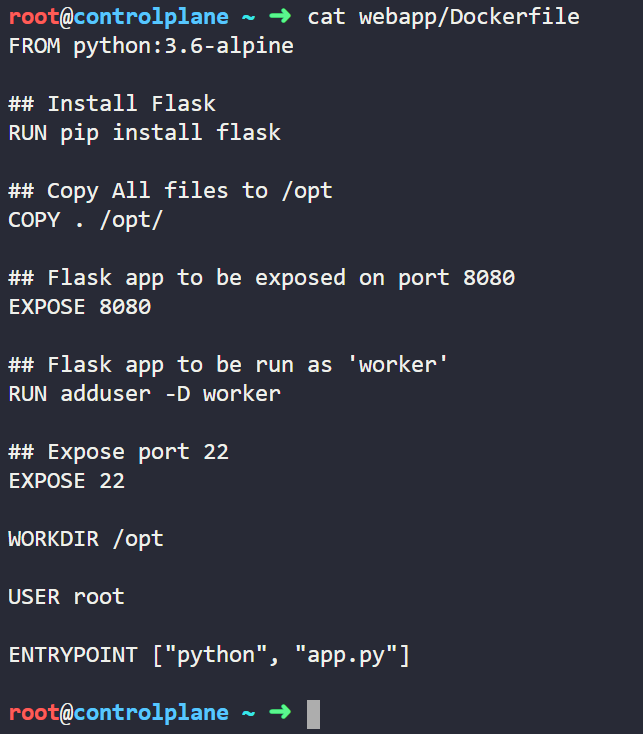

## Step 1: Dockerfile (webapp)

*Click on Dockerfile(webapp) icon present in the interactive architecture diagram in the challenge lab*

### Task 1: Run as non root (instead, use correct application user)

Run the below command to see the Dockerfile.

```bash
root@controlplan$ cat webapp/Dockerfile
```



You can see in the above image that the container is run as a root user, whereas the flask app is run as user worker. As per the challenge, the container should run as a non root user (application user)

Refer to this [article](https://www.geeksforgeeks.org/docker-user-instruction/ "Docker USER instruction") for an overview of USER command.

In the Dockerfile, replace 'USER root' with 'USER worker'

You can click on the 'Check' button to verify that this task is now completed.

### Task 2: Avoid exposing unnecessary ports

In the Dockerfile, you can see that two ports are exposed with 'EXPOSE' command

Refer to this [article](https://www.geeksforgeeks.org/docker-expose-instruction/ "Docker EXPOSE instruction") for an overview of EXPOSE command.

Port 8080 is used by the flask app. Port 22 is used for SSH connections, which is not required in this case. So you can remove 'EXPOSE 22' from the Dockerfile.

You can click on the 'Check' button to verify that this task is now completed.

### Task 3: Avoid copying the 'Dockerfile' and other unnecessary files and directories in to the image. Move the required files and directories (app.py, requirements.txt and the templates directory) to a subdirectory called 'app' under 'webapp' and update the COPY instruction in the 'Dockerfile' accordingly.

See the COPY command of Dockerfile, it copies all the files and directories present in webapp directory in to the image. 

Execute the following commands to move webapp/app.py, webapp/requirements.txt, webapp/templates to app under webapp.

Refer to this [article](https://www.geeksforgeeks.org/docker-copy-instruction/ "Docker COPY instruction") for an overview of COPY command.

```bash
root@controlplan$ cd webapp
root@controlplan$ mkdir app
root@controlplan$ mv app.py app
root@controlplan$ mv requirements.txt app
root@controlplan$ mv templates app
```

Now update the COPY command to copy all files from app directory to /opt

COPY /app /opt/

You can click on the 'Check' button to verify that this task is now completed.

### Task 4: Once the security issues are fixed, rebuild this image locally with the tag 'kodekloud/webapp-color:stable'

Refer to this [article](https://devopscube.com/build-docker-image/ "Docker BUILD image") for an overview of Docker BUILD command.

Run the following command to build the image locally.

```bash
root@controlplan$ docker build -t kodekloud/webapp-color:stable .
```

You can click on the 'Check' button to verify that this task is now completed.

## Step 2: kubesec

*Click on kubesec icon present in the interactive architecture diagram in the challenge lab*

### Task 1: Fix issues with the '/root/dev-webapp.yaml' file which was used to deploy the 'dev-webapp' pod in the 'dev' namespace.


You can click on the 'Check' button to verify that this task is now completed.

### Task 2: Redeploy the 'dev-webapp' pod once issues are fixed with the image 'kodekloud/webapp-color:stable'


You can click on the 'Check' button to verify that this task is now completed.

### Task 3: Fix issues with the '/root/staging-webapp.yaml' file which was used to deploy the 'staging-webapp' pod in the 'staging' namespace.


You can click on the 'Check' button to verify that this task is now completed.

### Task 4: Redeploy the 'staging-webapp' pod once issues are fixed with the image 'kodekloud/webapp-color:stable'


You can click on the 'Check' button to verify that this task is now completed.

## Step 3: dev-webapp

*Click on dev-webapp icon present in the interactive architecture diagram in the challenge lab*

### Task 1: Ensure that the pod 'dev-webapp' is immutable


You can click on the 'Check' button to verify that this task is now completed.

### Task 2: This pod can be accessed using the 'kubectl exec' command. We want to make sure that this does not happen. Use a startupProbe to remove all shells before the container startup. Use 'initialDelaySeconds' and 'periodSeconds' of '5'


You can click on the 'Check' button to verify that this task is now completed.

### Task 3: Image used: 'kodekloud/webapp-color:stable'


You can click on the 'Check' button to verify that this task is now completed.

### Task 4: Redeploy the pod as per the above recommendations and make sure that the application is up.


You can click on the 'Check' button to verify that this task is now completed.

## Step 4: staging-webapp

*Click on staging-webapp icon present in the interactive architecture diagram in the challenge lab*

### Task 1: Ensure that the pod 'staging-webapp' is immutable


You can click on the 'Check' button to verify that this task is now completed.

### Task 2: This pod can be accessed using the 'kubectl exec' command. We want to make sure that this does not happen. Use a startupProbe to remove all shells before the container startup. Use 'initialDelaySeconds' and 'periodSeconds' of '5'


You can click on the 'Check' button to verify that this task is now completed.

### Task 3: Image used: 'kodekloud/webapp-color:stable'


You can click on the 'Check' button to verify that this task is now completed.

### Task 4: Redeploy the pod as per the above recommendations and make sure that the application is up.


You can click on the 'Check' button to verify that this task is now completed.

## Step 5: prod-web

*Click on prod-web icon present in the interactive architecture diagram in the challenge lab*

### Task 1: The deployment has a secret hardcoded. Instead, create a secret called 'prod-db' for all the hardcoded values and consume the secret values as environment variables within the deployment.


You can click on the 'Check' button to verify that this task is now completed.

## Step 6: prod-netpol

*Click on prod-netpol icon present in the interactive architecture diagram in the challenge lab*

### Task 1: Use a network policy called 'prod-netpol' that will only allow traffic only within the 'prod' namespace. All the traffic from other namespaces should be denied.


You can click on the 'Check' button to verify that this task is now completed.