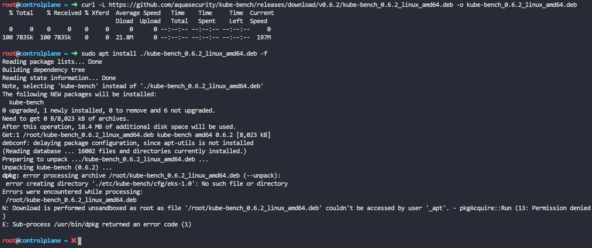

## Step 1: Download & run kube-bench

*Click on kube-bench icon present in the interactive architecture diagram in the challenge lab*

### Task 1: Download & extract kube-bench

Open the [kube-bench install docs](https://github.com/aquasecurity/kube-bench/blob/main/docs/installation.md "install kube-bench") 

#### Method 1 (which doesn't work)

Run the following command to find out the OS version of the controlplane node

```bash
root@controlplane$ cat /etc/os-release
```

It is an Ubuntu VM.

As per kube-bench install docs, below mentioned two commands should install kube-bench on controlplane, but it throws error for me.

```bash
root@controlplane$ curl -L https://github.com/aquasecurity/kube-bench/releases/download/v0.6.2/kube-bench_0.6.2_linux_amd64.deb -o kube-bench_0.6.2_linux_amd64.deb
root@controlplane$ sudo apt install ./kube-bench_0.6.2_linux_amd64.deb -f
```



If you look at the error, it says that there is an error creating diretory at /etc/kube.... . This means that this method of installtion extracts the kube-bench in /etc folder and is missing required directories. As per question, we have to extract kube-bench under /opt filesystem. So, this method will not work for our use case. Even if you try to run these commands inside /opt directory, it will still throw an error (I'll leave that as an exercise for you to perform). For sure, there must be some resolution to the above mentioned errors, but that is not our goal here, so will move to the second method. (in case if you find a solution for the above mentioned error, please create a PR)

#### Method 2 (which does work)

Manually download and extract the kube-bench binary.

Run the following command to move to the /opt directory
```bash
root@controlplane$ cd /opt/
```

Run the following command to download the binary
```bash
root@controlplane$ curl -L https://github.com/aquasecurity/kube-bench/releases/download/v0.6.2/kube-bench_0.6.2_linux_amd64.tar.gz -o kube-bench_0.6.2_linux_amd64.tar.gz
```

Run the following command to extract the binary
```bash
root@controlplane$ tar -xvf kube-bench_0.6.2_linux_amd64.tar.gz
```

You can click on the 'Check' button to verify that the first task is now completed.

If you try to install the latest version of the binary like v0.6.13-rc, you will be able to complete both tasks in this step, but the 'Check' fails to pass. Probably because the way evaluation logic for this lab is implemented is aligned with the default version mentioned in the aquasec docs. (If you find any other reason, then as always, please create a PR to include your findings)

### Task 2: Run kube-bench

Run the following command to make a directory to store the results
```bash
root@controlplane$ mkdir -p /var/www/html/
```

Run the following command to store the result of kube-bench command. (this command is also mentioned in the installation doc)
```bash
root@controlplane$ ./kube-bench run --config-dir /opt/cfg --config /opt/cfg/config.yaml > /var/www/html/index.html
```

You can click on the 'Check' button to verify that both the tasks related to kube-bench are now completed.

## Step 2: Fix issues on kubelet (node)

*Click on kubelet (node) icon present in the interactive architecture diagram in the challenge lab*

### Task 1: Ensure that the --protect-kernel-defaults argument is set to true (node01)

## Step 3: Fix issues on kubelet (controlplane node)

*Click on kubelet (controlplane) icon present in the interactive architecture diagram in the challenge lab*

### Task 1: Ensure that the --protect-kernel-defaults argument is set to true (controlplane)

## Step 4: Fix issues on kube-controller-manager

*Click on kube-controller-manager icon present in the interactive architecture diagram in the challenge lab*

### Task 1: Ensure that the --profiling argument is set to false

## Step 5: Fix issues on etcd

*Click on etcd icon present in the interactive architecture diagram in the challenge lab*

### Task 1: Correct the etcd data directory ownership

## Step 6: Fix issues on kube-scheduler

*Click on kube-scheduler icon present in the interactive architecture diagram in the challenge lab*

### Task 1: Ensure that the --profiling argument is set to false

## Step 7: Fix issues on kube-apiserver

*Click on kube-apiserver icon present in the interactive architecture diagram in the challenge lab*

### Task 1: Ensure that the --profiling argument is set to false

### Task 2: Ensure PodSecurityPolicy admission controller is enabled

### Task 3: Ensure that the --insecure-port argument is set to 0

### Task 4: Ensure that the --audit-log-path argument is set to /var/log/apiserver/audit.log

### Task 5: Ensure that the --audit-log-maxage argument is set to 30

### Task 6: Ensure that the --audit-log-maxbackup argument is set to 10

### Task 7: Ensure that the --audit-log-maxsize argument is set to 100