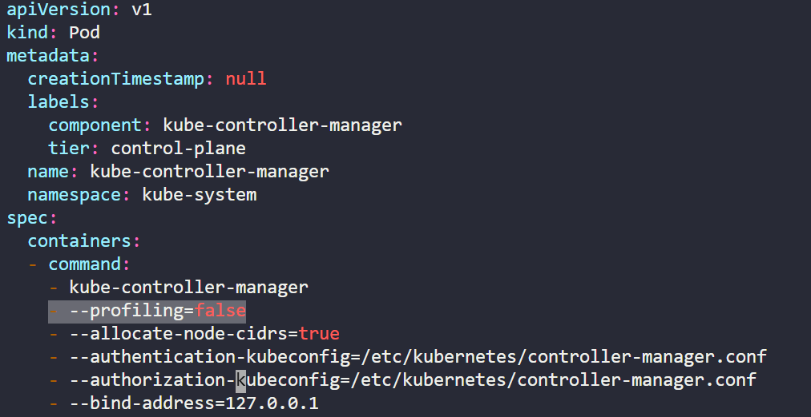

**NOTE**: You can find all the YAML manifest files used for this challenge in the current directory.

<details>

<summary><h2>Step 1: Download & run kube-bench</h2></summary>

*Click on kube-bench icon present in the interactive architecture diagram in the challenge lab*

### Task 1: Download 'kube-bench' from AquaSec and extract it under '/opt' filesystem. Use the appropriate steps from the kube-bench docs to complete this task.

Open the [kube-bench install docs](https://github.com/aquasecurity/kube-bench/blob/main/docs/installation.md "install kube-bench") 

#### Method 1 (which doesn't work)

Run the following command to find out the OS version of the controlplane node.

```bash
root@controlplane$ cat /etc/os-release
```

It is an Ubuntu VM.

As per kube-bench install docs, below mentioned two commands should install kube-bench on controlplane, but it throws error for me.

```bash
root@controlplane$ curl -L https://github.com/aquasecurity/kube-bench/releases/download/v0.6.2/kube-bench_0.6.2_linux_amd64.deb -o kube-bench_0.6.2_linux_amd64.deb
root@controlplane$ sudo apt install ./kube-bench_0.6.2_linux_amd64.deb -f
```


If you look at the error, it says that there is an error creating diretory at /etc/kube.... . This means that this method of installtion extracts the kube-bench in /etc folder and is missing required directories. As per question, we have to extract kube-bench under /opt filesystem. So, this method will not work for our use case. Even if you try to run these commands inside /opt directory, it will still throw an error (I'll leave that as an exercise for you to perform). For sure, there must be some resolution to the above mentioned errors, but that is not our goal here, so will move to the second method. (in case if you find a solution for the above mentioned error, please create a PR)

#### Method 2 (which does work)

Manually download and extract the kube-bench binary.

Run the following command to move to the /opt directory.

```bash
root@controlplane$ cd /opt/
```

Run the following command to download the binary.

```bash
root@controlplane$ curl -L https://github.com/aquasecurity/kube-bench/releases/download/v0.6.2/kube-bench_0.6.2_linux_amd64.tar.gz -o kube-bench_0.6.2_linux_amd64.tar.gz
```

Run the following command to extract the binary.

```bash
root@controlplane$ tar -xvf kube-bench_0.6.2_linux_amd64.tar.gz
```

See the below screenshot, config files are now present in cfg directory.


You can click on the 'Check' button to verify that the first task is now completed.

If you try to install the latest version of the binary like v0.6.13-rc, you will be able to complete both tasks in this step, but the 'Check' fails to pass. Probably because the way evaluation logic for this lab is implemented is aligned with the default version mentioned in the aquasec docs. (If you find any other reason, then as always, please create a PR to include your findings)

### Task 2: Run 'kube-bench' with config directory set to '/opt/cfg' and '/opt/cfg/config.yaml' as the config file. Redirect the result to '/var/www/html/index.html' file.

Run the following command to make a directory to store the results.

```bash
root@controlplane$ mkdir -p /var/www/html/
```

Run the following command to store the result of kube-bench command. (this command is also mentioned in the installation doc)

```bash
root@controlplane$ ./kube-bench run --config-dir /opt/cfg --config /opt/cfg/config.yaml > /var/www/html/index.html
```

You can click on the 'Check' button to verify that both the tasks related to kube-bench are now completed.

</details>

<details>

<summary><h2>Step 2: Fix issues on kubelet (node)</h2></summary>

*Click on kubelet (node) icon present in the interactive architecture diagram in the challenge lab*

### Task 1: Ensure that the --protect-kernel-defaults argument is set to true (node01)

To resolve these issues, we will first locate them in the results file of kube-bench command which is stored at /var/www/html/index.html. It will give us remediation steps that we need to follow to resolve these issues. We will follow this for all the issues.

The result of kube-bench command is stored at /var/www/html/index.html, we will refer to this file to get the remediation steps for all the issues in all the components in this lab.

Run the following command to know the details of CIS control corresponding to this task 

```bash
root@controlplane$ cat /var/www/html/index.html | grep -i protect-kernel-defaults
```


In the above image, note the control number, 4.2.6. Now let's see this control in detail. Open /var/www/html/index.html in VIM editor and search for 4.2.6 by typing '/4.2.6' and then press return, press 'n' to go to the next occurence of the string.

```bash
root@controlplane$ vim /var/www/html/index.html
```


There are two occurences of '4.2.6', in the above image you can see the remediation steps mentioned. Now we will implement these steps to remediate this issue from the worker node.

Run the below command to know the exact name of the worker node.

```bash
root@controlplane$ kubectl get nodes
```


Run the following command to SSH to node01 

```bash
root@controlplane$ ssh node01
```


As per the above image, there are two ways to resolve this issue, we will use the kubelet config file and add 'protectKernelDefaults: true' to the file.

Let's first locate the kubelet config file. Run the below command to find the location of kubelet config file.

```bash
root@node01$ ps -ef | grep kubelet
```


In the above image, notice the location highlighted, '/var/lib/kubelet/config.yaml'

Open the kubelet config file in VIM using the below command

```bash
root@node01$ vim /var/lib/kubelet/config.yaml
```

Insert 'protectKernelDefaults: true' at the end of the kubelet config file and save the changes made.


Now run the below two commands to reload the daemon and restart kubelet service

```bash
root@node01$ systemctl daemon-reload
root@node01$ systemctl restart kubelet.service
```

Run the following command to exit from node01.

```bash
root@node01$ exit
```

You can click on the 'Check' button to verify that this task is now completed.

</details>

<details>

<summary><h2>Step 3: Fix issues on kubelet (controlplane node)</h2></summary>

*Click on kubelet (controlplane) icon present in the interactive architecture diagram in the challenge lab*

### Task 1: Ensure that the --protect-kernel-defaults argument is set to true (controlplane)

Since the issue is similar to the issue found on worker node, so the remediation will be similar to one mentioned in Step 2.

Let's first locate the kubelet config file. Run the below command to find the location of kubelet config file.

```bash
root@controlplane$ ps -ef | grep kubelet
```


In the above image, notice the location highlighted, '/var/lib/kubelet/config.yaml'

Open the kubelet config file in VIM using the below command

```bash
root@node01$ vim /var/lib/kubelet/config.yaml
```

Insert 'protectKernelDefaults: true' at the end of the kubelet config file and save the changes made.


Now run the below two commands to reload the daemon and restart kubelet service

```bash
root@node01$ systemctl daemon-reload
root@node01$ systemctl restart kubelet.service
```

You can click on the 'Check' button to verify that this task is now completed.

</details>

<details>

<summary><h2>Step 4: Fix issues on kube-controller-manager</h2></summary>

*Click on kube-controller-manager icon present in the interactive architecture diagram in the challenge lab*

### Task 1: Ensure that the --profiling argument is set to false

Run the following command to know the details of CIS control corresponding to this task 

```bash
root@controlplane$ cat /var/www/html/index.html | grep -i profiling
```


In the above image, we can see that there are 3 controls where 'profiling' as a keyword appears. Now let's see these controls in detail. Open /var/www/html/index.html in VIM editor and search for these controls.

```bash
root@controlplane$ vim /var/www/html/index.html
```


Clearly, control 1.3.2 is to be followed here as the issue is on controller manager

Open the controller manager pod specification file and set --profiling=false

```bash
root@controlplane$ vim /etc/kubernetes/manifests/kube-controller-manager.yaml
```



Save the file and exit.

You can click on the 'Check' button to verify that this task is now completed.

</details>

<details>

<summary><h2>Step 5: Fix issues on etcd</h2></summary>

*Click on etcd icon present in the interactive architecture diagram in the challenge lab*

### Task 1: Correct the etcd data directory ownership

Run the following command to know the details of CIS control corresponding to this task 

```bash
root@controlplane$ cat /var/www/html/index.html | grep -i 'etcd data directory ownership'
```


Now let's see the control 1.1.12 in detail. Open /var/www/html/index.html in VIM editor and search for this controls.

```bash
root@controlplane$ vim /var/www/html/index.html
```


As per the above remediation, run the following command to find the etcd data directory

```bash
root@controlplane$ ps -ef | grep etcd
```


See the highlighted text in the above image, etcd data directory path is '/var/lib/etcd'

Run the below command.

```bash
root@controlplane$ chown etcd:etcd /var/lib/etcd
```

You can click on the 'Check' button to verify that this task is now completed.

</details>

<details>

<summary><h2>Step 6: Fix issues on kube-scheduler</h2></summary>

*Click on kube-scheduler icon present in the interactive architecture diagram in the challenge lab*

### Task 1: Ensure that the --profiling argument is set to false

Since the same issue was present on controller manager as well, hence this step will be quite similar to Step 4.

Run the following command to know the details of CIS control corresponding to this task 

```bash
root@controlplane$ cat /var/www/html/index.html | grep -i profiling
```


In the above image, we can see that there are 3 controls where 'profiling' as a keyword appears. Now let's see these controls in detail. Open /var/www/html/index.html in VIM editor and search for these controls.

```bash
root@controlplane$ vim /var/www/html/index.html
```


Clearly, control 1.4.1 is to be followed here as the issue is on kube-scheduler

Open the scheduler pod specification file and set --profiling=false

```bash
root@controlplane$ vim /etc/kubernetes/manifests/kube-scheduler.yaml
```


Save the file and exit.

Wait for sometime, the kube scheduler pod has to restart now, once it is running again, you can click on the 'Check' button to verify that this task is now completed.

Run the following command to restart kubelet.

```bash
root@controlplane$ systemctl restart kubelet
```

</details>

<details>

<summary><h2>Step 7: Fix issues on kube-apiserver</h2></summary>

*Click on kube-apiserver icon present in the interactive architecture diagram in the challenge lab*

### Task 1: Ensure that the --profiling argument is set to false

Since the same issue was present on controller manager as well, hence this task will be quite similar to Step 4.

Run the following command to know the details of CIS control corresponding to this task 

```bash
root@controlplane$ cat /var/www/html/index.html | grep -i profiling
```


In the above image, we can see that there are 3 controls where 'profiling' as a keyword appears. Now let's see these controls in detail. Open /var/www/html/index.html in VIM editor and search for these controls.

```bash
root@controlplane$ vim /var/www/html/index.html
```


Clearly, control 1.2.21 is to be followed here as the issue is on kube-apiserver

Open the apiserver pod specification file and set --profiling=false

```bash
root@controlplane$ vim /etc/kubernetes/manifests/kube-apiserver.yaml
```


Wait for sometime, let the kube-apiserver pod restart again. To check, run the following command.

```bash
root@controlplane$ kubectl get pods -n kube-system
```

Once the above command gives correct ouput. You can click on the 'Check' button to verify that this task is now completed.

### Task 2: Ensure PodSecurityPolicy admission controller is enabled

Run the following command to know the details of CIS control corresponding to this task 

```bash
root@controlplane$ cat /var/www/html/index.html | grep -i PodSecurityPolicy
```


In the above image, we can see that the control 1.2.16 highlights the issue at hand. Now let's see this controls in detail. Open /var/www/html/index.html in VIM editor and search for this controls.

```bash
root@controlplane$ vim /var/www/html/index.html
```


*I did not have much knowledge on PSP before attempting this task, I learnt about it on the go, refer to this [article](https://kubevious.io/blog/post/securing-kubernetes-using-pod-security-policy-admission-controller "PodSecurityPolicy") for an explanation of PSPs.*

We first need to create PSP objects which includes a PodSecurityPolicy, ClusterRole, ClusterRoleBinding. Find the relevant yaml manifests file in the same directory by the name of psp.yaml, clusterRole.yaml, clusterRoleBinding.yaml. Run the following command to apply these files.

```bash
root@controlplane$ kubectl apply -f psp.yaml
root@controlplane$ kubectl apply -f clusterRole.yaml
root@controlplane$ kubectl apply -f clusterRoleBinding.yaml
```

Open the apiserver pod specification file and set --enable-admission-plugins=...,PodSecurityPolicy,...

```bash
root@controlplane$ vim /etc/kubernetes/manifests/kube-apiserver.yaml
```


Wait for sometime, let the kube-apiserver pod restart again. To check, run the following command.

```bash
root@controlplane$ kubectl get pods -n kube-system
```

Once the above command gives correct ouput. You can click on the 'Check' button to verify that this task is now completed.

### Task 3: Ensure that the --insecure-port argument is set to 0

Run the following command to know the details of CIS control corresponding to this task 

```bash
root@controlplane$ cat /var/www/html/index.html | grep -i insecure-port
```


In the above image, we can see that control 1.2.19 highlights this issue. Now let's see this control in detail. Open /var/www/html/index.html in VIM editor and search for these controls.

```bash
root@controlplane$ vim /var/www/html/index.html
```


Open the kube apiserver pod specification file and set --insecure-port=0

```bash
root@controlplane$ vim /etc/kubernetes/manifests/kube-apiserver.yaml
```


Save the file and exit.

Wait for sometime, let the kube-apiserver pod restart again. To check, run the following command.

```bash
root@controlplane$ kubectl get pods -n kube-system
```

Once the above command gives correct ouput. You can click on the 'Check' button to verify that this task is now completed.

### Task 4: Ensure that the --audit-log-path argument is set to /var/log/apiserver/audit.log

Run the following command to know the details of CIS control corresponding to this task 

```bash
root@controlplane$ cat /var/www/html/index.html | grep -i audit-log-path
```


In the above image, we can see that control 1.2.22 highlights this issue. Now let's see this control in detail. Open /var/www/html/index.html in VIM editor and search for these controls.

```bash
root@controlplane$ vim /var/www/html/index.html
```


*I had no knowledge of Auditing (just like other security concepts) prior to this lab. I learnt it on the go. Refer to this [article](https://kubernetes.io/docs/tasks/debug/debug-cluster/audit/ "Auditing") which explains Auditing in K8s.*

Refer to [Log backend](https://kubernetes.io/docs/tasks/debug/debug-cluster/audit/#log-backend "Log backend") section of the article.

In order to set --audit-log-path, we need to mount audit-log volume and configure the hostPath.

Open the kube apiserver pod specification file and make following changes to it.

```bash
root@controlplane$ vim /etc/kubernetes/manifests/kube-apiserver.yaml
```

```YAML
- --audit-log-path=/var/log/apiserver/audit.log
```


```YAML
- mountPath: /var/log/apiserver/
  name: audit-log
  readOnly: false
```


```YAML
- hostPath:
    path: /var/log/apiserver/
    type: DirectoryOrCreate
  name: audit-log
```


Save the file and exit.

Wait for sometime, let the kube-apiserver pod restart again. To check, run the following command.

```bash
root@controlplane$ kubectl get pods -n kube-system
```

Once the above command gives correct ouput. You can click on the 'Check' button to verify that this task is now completed.

### Task 5: Ensure that the --audit-log-maxage argument is set to 30

Run the following command to know the details of CIS control corresponding to this task. 

```bash
root@controlplane$ cat /var/www/html/index.html | grep -i audit-log-maxage
```


In the above image, we can see that control 1.2.23 highlights this issue. Now let's see this control in detail. Open /var/www/html/index.html in VIM editor and search for these controls.

```bash
root@controlplane$ vim /var/www/html/index.html
```


Open the kube apiserver pod specification file and set --audit-log-maxage=30

```bash
root@controlplane$ vim /etc/kubernetes/manifests/kube-apiserver.yaml
```


Save the file and exit.

Wait for sometime, let the kube-apiserver pod restart again. To check, run the following command.

```bash
root@controlplane$ kubectl get pods -n kube-system
```

Once the above command gives correct ouput. You can click on the 'Check' button to verify that this task is now completed.

### Task 6: Ensure that the --audit-log-maxbackup argument is set to 10

Run the following command to know the details of CIS control corresponding to this task 

```bash
root@controlplane$ cat /var/www/html/index.html | grep -i audit-log-maxbackup
```


In the above image, we can see that control 1.2.24 highlights this issue. Now let's see this control in detail. Open /var/www/html/index.html in VIM editor and search for these controls.

```bash
root@controlplane$ vim /var/www/html/index.html
```


Open the kube apiserver pod specification file and set --audit-log-maxbackup=10

```bash
root@controlplane$ vim /etc/kubernetes/manifests/kube-apiserver.yaml
```


Save the file and exit.

Wait for sometime, let the kube-apiserver pod restart again. To check, run the following command.

```bash
root@controlplane$ kubectl get pods -n kube-system
```

Once the above command gives correct ouput. You can click on the 'Check' button to verify that this task is now completed.

### Task 7: Ensure that the --audit-log-maxsize argument is set to 100

Run the following command to know the details of CIS control corresponding to this task 

```bash
root@controlplane$ cat /var/www/html/index.html | grep -i audit-log-maxsize
```


In the above image, we can see that control 1.2.25 highlights this issue. Now let's see this control in detail. Open /var/www/html/index.html in VIM editor and search for these controls.

```bash
root@controlplane$ vim /var/www/html/index.html
```


Open the kube apiserver pod specification file and set --audit-log-maxsize=100

```bash
root@controlplane$ vim /etc/kubernetes/manifests/kube-apiserver.yaml
```


Save the file and exit.

Wait for sometime, let the kube-apiserver pod restart again. To check, run the following command.

```bash
root@controlplane$ kubectl get pods -n kube-system
```

Once the above command gives correct ouput. You can click on the 'Check' button to verify that this task is now completed.

*NOTE: If you find your kube-system pods fails to run or their STATUS changes to CrashLoopBackOff repeatedly, then try to run the following command to troubleshoot.*

```bash
root@controlplane$ systemctl restart kubelet.service
```

See the below image


</details>