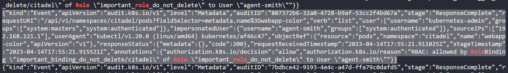

**NOTE**: You can find all the YAML manifest files used for this challenge in the current directory.

<details>

<summary><h2>Step 1: Falco</h2></summary>

*Click on Falco icon present in the interactive architecture diagram in the challenge lab*

### Task 1: Install the 'falco' utility on the controlplane node and start it as a systemd service

Refer to this [article](https://v0-31.falco.org/docs/getting-started/installation/ "Falco installation") for Falco installation guide.

We will install Falco v0.31.1, latest version of Falco does not passes the 'Check' of the lab, maybe the lab is configured to work with this version itself. (Please create a PR if you are able to successfully pass the 'Check' with latest version of Flaco).

Installation guide for latest version of Falco can be found [here](https://falco.org/docs/getting-started/try-falco/try-falco-on-ubuntu/ "Falco installation").

As mentioned in the guilde, run the following command to install Falco.

```bash
root@controlplane$ curl -s https://falco.org/repo/falcosecurity-3672BA8F.asc | apt-key add -
root@controlplane$ echo "deb https://download.falco.org/packages/deb stable main" | tee -a /etc/apt/sources.list.d/falcosecurity.list
root@controlplane$ apt-get update -y
root@controlplane$ apt-get -y install linux-headers-$(uname -r)
root@controlplane$ apt-get install -y falco
root@controlplane$ systemctl start falco
```

You can click on the 'Check' button to verify that this task is now completed.

</details>

<details>

<summary><h2>Step 2: file-output</h2></summary>

*Click on file-output icon present in the interactive architecture diagram in the challenge lab*

### Task 1: Configure falco to save the event output to the file '/opt/falco.log'

A simple Google search on 'Configure falco to save event output to a file' will help you land to the relevant [article](https://falco.org/docs/reference/daemon/config-options/ "Falco config options") from Falco's documentation.

file_output option is the relevant option for our use case.

Create a log file for Falco to save the event output using the following command.

```bash
root@controlplane$ touch /opt/falco.log
```

Edit the falco.yaml file to enable file output. But first you need to know the location of falco.yaml file, again a simple Google search on 'location of falco.yaml file' will give you the answer.

```bash
root@controlplane$ vim /etc/falco/falco.yaml
```


Whenever any change is made to a service, it is a good practice to restart it, so, restart Falco service using the following command.

```bash
root@controlplane$ systemctl restart falco
```

You can click on the 'Check' button to verify that this task is now completed.

</details>

<details>

<summary><h2>Step 3: Auditing</h2></summary>

*Click on Auditing icon present in the interactive architecture diagram in the challenge lab*

### Task 1: The audit policy file should be stored at '/etc/kubernetes/audit-policy.yaml'

We need to configure auditing in this cluster. Let's first create an audit policy file using the following command.

```bash
root@controlplane$ touch /etc/kubernetes/audit-policy.yaml
```

You can click on the 'Check' button to verify that this task is now completed.

### Task 2: Use a volume called 'audit' that will mount only the file '/etc/kubernetes/audit-policy.yaml' from the controlplane inside the api server pod in a read only mode.

Refer to this [article](https://kubernetes.io/docs/tasks/debug/debug-cluster/audit/#log-backend "Auditing in Kubernetes") on how to mount audit-policy.yaml file.

Edit the kube-apiserver manifest file and make the following changes.

```bash
root@controlplane$ vim /etc/kubernetes/manifests/kube-apiserver.yaml
```


Save the file and exit.

You can click on the 'Check' button to verify that this task is now completed.

### Task 3: Create a single rule in the audit policy that will record events for the 'two' objects depicting abnormal behaviour in the 'citadel' namespace. This rule should however be applied to all 'three' namespaces shown in the diagram at a 'metadata' level. Omit the 'RequestReceived' stage.

Paste the content of audit-policy.yaml file present in this directory.

```bash
root@controlplane$ vim /etc/kubernetes/audit-policy.yaml
```

```YAML
apiVersion: audit.k8s.io/v1 
kind: Policy
omitStages:
  - "RequestReceived"
rules:
  - level: Metadata
    resources:
    - group: ""
      resources: ["configmaps","pods"]
    namespaces: ["citadel","omega","eden-prime"]
```

Save and exit.

Refer to this [article](https://kubernetes.io/docs/tasks/debug/debug-cluster/audit/ "Auditing in Kubernetes") for a guide to Kubernetes auditing.

Dissecting the audit-policy.yaml file: pod and configmap shows abnormal behaviour in citadel namespace, hence, they are set in resouces. As given in task statement, level will be metadata, namespace will be all three and RequestReceived stage has to be omitted.

You can click on the 'Check' button to verify that this task is now completed.

</details>

<details>

<summary><h2>Step 4: audit-log</h2></summary>

*Click on audit-log icon present in the interactive architecture diagram in the challenge lab*

### Task 1: audit-log-path set to '/var/log/kubernetes/audit/audit.log'

This task is very similar to task 2 of step 3.

Refer to this [article](https://kubernetes.io/docs/tasks/debug/debug-cluster/audit/#log-backend "Auditing in Kubernetes") on how to set audit-log-path.

Edit the kube-apiserver manifest file and make the following changes.

```bash
root@controlplane$ vim /etc/kubernetes/manifests/kube-apiserver.yaml
```


Save the file and exit.

You can click on the 'Check' button to verify that this task is now completed.

</details>

<details>

<summary><h2>Step 5: Security Report</h2></summary>

*Click on Security Report icon present in the interactive architecture diagram in the challenge lab*

### Task 1: Inspect the API server audit logs and identify the user responsible for the abnormal behaviour seen in the 'citadel' namespace. Save the name of the 'user', 'role' and 'rolebinding' responsible for the event to the file '/opt/blacklist_users' file (comma separated and in this specific order).

Run the following command to inspect the api server audit logs.

```bash
root@controlplane$ cat /var/log/kubernetes/audit/audit.log | grep -i role
```



See the highlighted part in the above image. User is "agent-smith", role is "important_role_do_not_delete" and roleBinding is "important_binding_do_not_delete"

Execute the following commands to store these values in required format.

```bash
root@controlplane$ echo "agent-smith,important_role_do_not_delete,important_binding_do_not_delete" > /opt/blacklist_users
```

You can click on the 'Check' button to verify that this task is now completed.

### Task 2: Inspect the 'falco' logs and identify the pod that has events generated because of packages being updated on it. Save the namespace and the pod name in the file '/opt/compromised_pods' (comma separated - namespace followed by the pod name)

Run the following command to inspect the falco logs.

```bash
root@controlplane$ cat /opt/falco.log | grep -i package
```


See the highlighted part in the above image. Namespace is "eden-prime" and pod name is "eden-software2".

Execute the following commands to store these values in required format.

```bash
root@controlplane$ echo "eden-prime,eden-software2" > /opt/compromised_pods
```

You can click on the 'Check' button to verify that this task is now completed.

</details>

<details>

<summary><h2>Step 6: Pod (omega)</h2></summary>

*Click on pod icon present in the omega namespace in the interactive architecture diagram in the challenge lab*

### Task 1: Delete pods belonging to the 'omega' namespace that were flagged in the 'Security Report' file '/opt/compromised_pods'. Do not delete the non-compromised pods!

The pod mentioned in security report /opt/compromised_pod belongs to eden-prime namespace and not omega, hence no need to delete any pod from omega namespace.

This task will already be in completed state.

</details>

<details>

<summary><h2>Step 7: Role</h2></summary> 

*Click on role icon present in the interactive architecture diagram in the challenge lab*

### Task 1: Delete the role causing the constant deletion and creation of the configmaps and pods in this namespace. Do not delete any other role!

Refer to security report /opt/blacklist_users. The role is 'important_role_do_not_delete'.

Run the following command to delete this role.

```bash
root@controlplane$ kubectl delete role -n citadel important_role_do_not_delete
```

You can click on the 'Check' button to verify that this task is now completed.

</details>

<details>

<summary><h2>Step 8: Role Binding</h2></summary> 

*Click on rb icon present in the interactive architecture diagram in the challenge lab*

### Task 1: Delete the rolebinding causing the constant deletion and creation of the configmaps and pods in this namespace. Do not delete any other rolebinding!

Refer to security report /opt/blacklist_users. The roleBinding is 'important_binding_do_not_delete'.

Run the following command to delete this roleBinding.

```bash
root@controlplane$ kubectl delete rolebinding -n citadel important_binding_do_not_delete
```

You can click on the 'Check' button to verify that this task is now completed.

</details>

<details>

<summary><h2>Step 9: Pod (eden-prime)</h2></summary> 

*Click on pod icon present in the eden-prime namespace in the interactive architecture diagram in the challenge lab*

### Task 1: Delete pods belonging to the 'eden-prime' namespace that were flagged in the 'Security Report' file '/opt/compromised_pods'. Do not delete the non-compromised pods!

Refer to security report /opt/compromised_pods. The pod is 'eden-software2'.

Run the following command to delete this pod.

```bash
root@controlplane$ kubectl delete pod -n eden-prime eden-software2 --grace-period=0 --force
```

You can click on the 'Check' button to verify that this task is now completed.

</details>